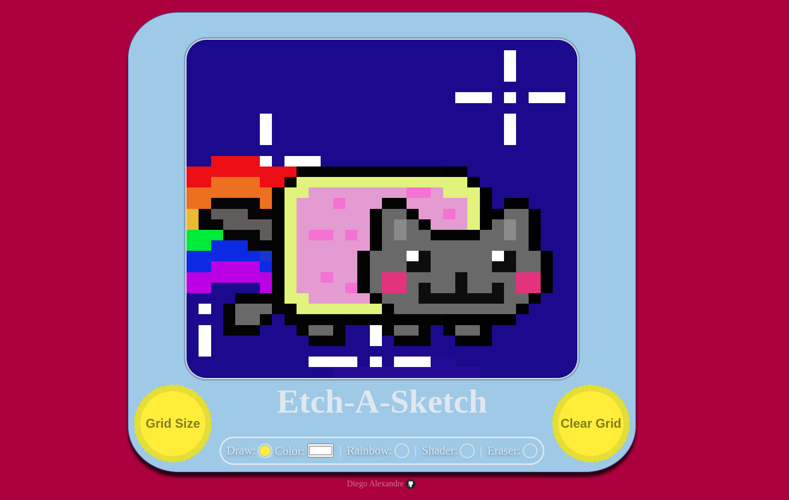

# Etch-a-Sketch
## Intro
Project to practice DOM manipulation from the TOP Foundations Course. It is built using CSS, HTML and Javascript to create a pixelated sketch.

## Preview

## Credits

- favicon - https://www.streamlinehq.com/emojis/freebies-freemojis?search=palette&icon=ico_mRu4pQZOsdEj49rvhjiJ4Kwc
